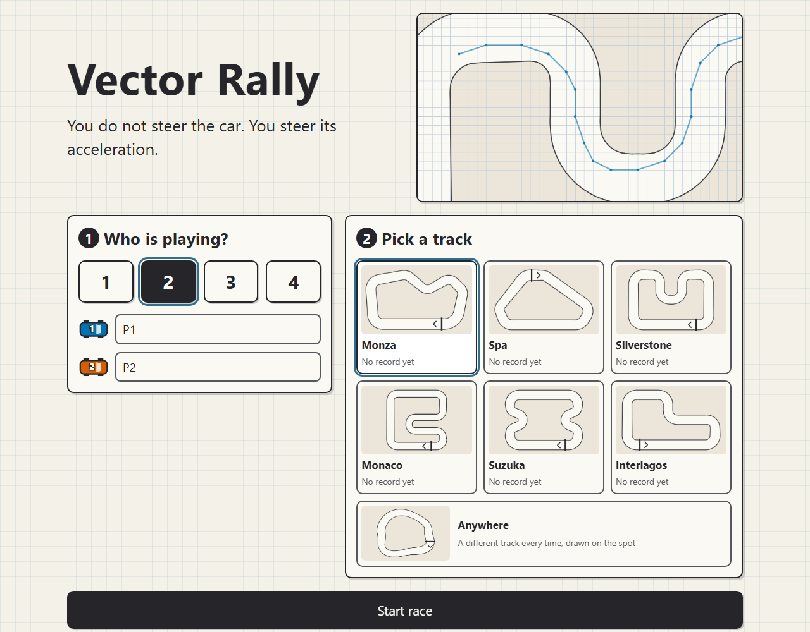

# Vector Rally



> **That picture is a placeholder, not a screenshot — please replace it.** It is
> drawn by `tools/make-icons.mjs` from the real track geometry, with the real
> agents driving a real race under the real rules, so the lines are honest: the
> jagged red one is Greedy, the smooth ones are two Planners. But there is no
> interface in it, because the script has no browser to photograph. Open the
> game, take a proper screenshot, and save it over `screenshot.png`.

A racing game for the browser, played on squared paper. Each car has a position
and a velocity vector. You do not steer the car — you steer its *acceleration*,
one unit per turn, and live with the momentum that follows.

Built as a teaching example: the rules are small enough to read in a minute,
and the interesting part — braking before a corner rather than after it — falls
out of the arithmetic instead of being programmed in.

## Rules

- A car stands on a **corner of the paper**: a point where two lines cross, not
  a square. Its position and its velocity are both pairs of whole numbers.
- Each turn you change `vx` and `vy` by −1, 0 or +1 each: nine possible moves.
  The car then travels in a straight line to position plus the new velocity.
- **Nothing is marked on the track.** Adding the velocity to the position is the
  whole exercise, and it cannot be the exercise if the answers are drawn on the
  screen to pick between. There is a switch on the race screen for showing the
  nine while the game is being explained, off unless somebody turns it on.
- Neither part of the velocity may leave −5…5.
- The whole line from where you are to where you land has to stay on the track.
  At speed 5 that line is five units long and can cut the corner out of a bend
  and back in again with both of its ends still on the track. That is leaving
  the track, and it is caught.
- Go off and the car does not get put back on the track. It comes to rest just
  outside it, where it crossed the edge, at a standstill — and from out there
  the only thing it may do is drive back on or stand still, so an excursion
  costs two turns and all the speed. Because nobody can check a curved edge by
  eye, the game shows the exact point where the line crossed and the piece of
  edge it crossed before moving the car.
- **Standing still is always allowed from a standstill**, on the track or off
  it. That one line is what keeps a race from ever locking up: a crash always
  leaves a car stopped, and a stopped car can always stay stopped, so there is
  always a move next turn. The proof is written beside the crash rule in
  `engine.js`, because the rule that a car off the track may only drive back on
  quietly broke it once already.
- Cars are points. Two of them may not stand on the same point, and a move
  whose line passes exactly through another car is impossible. Passing close is
  not — with point-sized cars there is room.
- A move that is genuinely impossible — another car exactly on the line, or
  over the speed limit — is crossed out on the pad and cannot be taken.
- One lap. It counts when you cross the finish line the way the arrows point,
  having passed every hidden checkpoint in order on the way round.

Every car starts on the finish line, side by side, at a standstill. 1–4 players
take turns on the same device. Mouse and touch only: work out the crossing you
are going to and press it. The crossing under your finger is ringed as you drag,
with the speed that move would leave you with; let go on it to go, or away from
any crossing to think again.

**There is no snapping to the nearest possible move.** Snapping would quietly
correct a miscalculation into a legal move the player never meant, and the one
sum the game exists to teach would be done for them without their noticing. Press
the wrong crossing and nothing happens, and the game says which kind of wrong it
was: *Not reachable from your velocity* means the sum was wrong, *Occupied* or
*Speed limit* means the sum was right and the rules say no. A race opens close
enough in that a crossing is a thumb across, and the board never zooms itself
after that — but zoom out past 44 pixels to the unit and the board becomes a
map: presses stop choosing moves and it says *Zoom in to move*. The radius a
press has to land within stays half a unit however far out you go, because
widening it would put the snapping back in by the back door.

A car stands on a corner of the paper, where two lines cross, not in the middle
of a square.

Starting a race is two screens: how many are playing, then which track — a
carousel you swipe through, one card at a time, each with the track drawn from
its own geometry.

## The track

A track is an **area of the plane** bounded by two closed curves, not a grid of
cells. The squares on the paper are there to count in; the edge of the track
pays them no attention.

Tracks are written as a centreline with a width:

```js
centerline: [[x, y, w], [x, y, w], ...]   // a closed loop, w is the half-width
```

The loop is smoothed with a closed Catmull-Rom spline and offset by ±w to make
the two edges. One description gives the edges, the driving line the arrows
follow, and the gates across the track all at once.

Offsetting has a trap: where the centreline bends tighter than w, the inner
edge folds through itself — Monaco's hairpin is exactly there. The parser
measures the curvature everywhere and refuses a track that bends too tightly,
so a broken track fails when it is loaded rather than in the third corner.

The finish line and the checkpoints are **gates**: a straight line across the
track with a direction. One move at speed 5 can pass two of them, so the
crossings are sorted along the line and taken in order — otherwise a car could
collect the second checkpoint and skip the first.

### The six

Monza, Spa, Silverstone, Monaco, Suzuka and Interlagos — named after places
rather than events. They are drawn by hand and are nowhere near measured
reproductions of real circuits; what they reproduce is character. Monza is fast
with three chicanes to brake for, Monaco is barely three units wide with a
hairpin, Interlagos is short and runs the other way round.

**Anywhere** is not a seventh track but a generator: it draws a closed
centreline from the seed of the race and checks it with the same parser
everything else goes through, flattening the shape and trying again if it came
out too tight. Its id carries the seed, so a race on one can be replayed or
reloaded. The tests run it over 2000 seeds.

A perfect lap, found by searching every `(point, velocity, checkpoints)` a car
can be in, takes 30 to 39 moves depending on the track. A beginner runs perhaps
70% over that, so reckon on 50–65 moves each: comfortable for two or three
players in a forty-minute lesson, tight for four on the longest tracks. There
is a button to end the race early.

## The computer drivers

Two of them, and they are not easy and hard — they are two different ideas
about how to drive, and the difference is meant to be visible from the back of
the room.

**Greedy** looks one move ahead and takes whichever of the nine gets it nearest
the next checkpoint while carrying the most speed. It measures that distance in
a straight line, so it knows nothing about the shape of the track: it
accelerates towards a corner it cannot see and arrives with nowhere left to go.

**Planner** runs A* over the states a car can be in — where it is and how fast
it is going — nine successors a state, one move each, with an admissible
estimate of `ceil(distance to the gate / 5)` measured the way a car actually
moves. It plans to the gate *after* the next one, not to the next one: a car
that only plans as far as the next gate arrives at it flat out and drives off
immediately afterwards, having met its goal and thought no further. Only the
first move of the plan is taken, and the rest is worked out again next turn.

Both steer by checkpoints the players cannot see, and the interface says so.

There is a node budget, 50,000 states a move. If the planner runs out it falls
back to Greedy **and says so on the screen** — a planner that quietly drove like
the greedy one would just look like a planner that is no good.

One lap on each track, one car alone, measured on an AMD Ryzen 9 5900HX under
Node 24 — a laptop, not a phone:

| Track | Greedy | Planner | Perfect |
|---|---|---|---|
| Monza | 82 moves, 16 off | 43 moves, 0 off | 39 |
| Spa | 57, 8 | 36, 0 | 34 |
| Silverstone | 77, 15 | 37, 0 | 34 |
| Monaco | 59, 11 | 42, 0 | 39 |
| Suzuka | 48, 7 | 34, 0 | 34 |
| Interlagos | 55, 11 | 32, 0 | 30 |

The planner's worst single move looked at about 3,000 states — a sixteenth of
its budget — at roughly 150,000 states a second, so 8 to 18 ms a move. The
budget has never actually run out on these tracks; the fallback is tested by
handing the planner a budget of five. Phone numbers are still to be measured.

There is a mode on the track screen that races Greedy against Planner with
nobody playing, for showing the difference on a projector.
### The Learner

A third driver learns instead of searching: tabular Q-learning, trained in the
page while you watch. It keeps a value for every (point, velocity) it has been
in and each of the nine moves, and nudges those values towards what actually
happened — −1 a move, −25 for leaving the track, 0 for arriving.

Every attempt starts **somewhere random**, any point on the track at any speed,
rather than on the grid. Dropped on the line every time, a car moving at random
would essentially never arrive anywhere and the curve would be a flat line
along the top of the chart.

**Nothing is saved.** Reload and the table is gone. The curve is the
demonstration, and a table that already existed when the lesson began would
take the demonstration away. The table also only knows the track it was taught,
and it says so when asked to drive somewhere else.

Training runs in a Web Worker so the page stays alive; where there is no worker
it runs in twelve-millisecond slices between frames instead. Stop works
immediately either way.

Three things about it are not what the first sketch of this called for, and
each is here because the first sketch did not work:

- **What it aims at is the next gate, not the finish line.** A whole lap is
  further off than the discount can see: at 0.95, anything beyond about twenty
  moves is worth as much as anything else, so the table comes out flat and the
  car sits still because every move looks the same. Measured: with a lap-long
  goal it got round on 1 of 18 attempts. Aiming at the next gate — a few moves
  off, well inside the horizon — and repeating, *is* a lap. That got 16 of 18.
- **The learning rate falls away**, from 0.2 to 0.02 over the run. A rate that
  stays high keeps knocking a nearly-settled table about, and the car drives
  differently every time you train it.
- **Going back through a gate ends the attempt.** Otherwise there is a cheat
  worth finding: reverse through a gate and come straight back for the reward,
  two moves instead of driving to the next one.

All of the dials — learning rate, discount, how much it explores at each end,
how many attempts, and potential-based shaping — are on the screen, so the
failures above can be reproduced in front of a class by turning the discount
back down to 0.95 with a lap-long goal.

Measured on an AMD Ryzen 9 5900HX under Node 24, 400,000 attempts a track —
the default went up from 150,000 when a car that goes off started coming to
rest off the track, which is a harder thing to learn than being put back on the
racing line was. At 150,000 it got round on 10 of 18 runs; at 400,000, on 14.

| Track | Trained in | Attempts a second | States | Moves an attempt |
|---|---|---|---|---|
| Monza | 5.9 s | 25,500 | 90,000 | 16.3 → 8.2 |
| Spa | 5.6 s | 26,700 | 87,000 | 17.8 → 8.3 |
| Silverstone | 4.9 s | 30,700 | 90,100 | 21.5 → 7.8 |
| Monaco | 5.2 s | 28,700 | 60,600 | 16.9 → 5.4 |
| Suzuka | 5.0 s | 30,000 | 77,700 | 16.2 → 7.2 |
| Interlagos | 4.5 s | 33,100 | 72,700 | 12.2 → 5.6 |

**There are still no phone figures here, and I cannot produce any**: there is
no phone on this machine to run it on, and a number worked out from a laptop
by multiplying is a guess dressed up as a measurement.

What the training screen does instead is measure the device it is actually on.
Before training it runs a tenth of a second of real attempts and says *about N
seconds for 400,000 attempts on this device, at about R a second*; over ninety
seconds it says so plainly and suggests fewer attempts, with the warning that
the driving will be worse. While training runs it shows the seconds left. So
the phone answers the question itself, in front of the class, and the honest
figure for your phone is the one it prints — please write it into the table
below.

And then the point of the whole thing. One lap, one car alone, same machine:

| Track | Greedy | Planner | Learner | Perfect |
|---|---|---|---|---|
| Monza | 82 moves, 16 off | 43, 0 | 89, 6 | 39 |
| Spa | 57, 8 | 36, 0 | 93, 7 | 34 |
| Silverstone | 77, 15 | 37, 0 | 73, 3 | 34 |
| Monaco | 59, 11 | 42, 0 | 66, 4 | 39 |
| Suzuka | 48, 7 | 34, 0 | 62, 5 | 34 |
| Interlagos | 55, 11 | 32, 0 | 56, 5 | 30 |

The Learner, after a hundred and fifty thousand attempts, loses to the Planner
everywhere and to the Greedy driver in places. That is the honest result and
the useful one: the track never changes and can be seen in full, so searching
works out exactly what learning can only approximate. It is also not reliable —
2 of 18 training runs produced a table that never got round at all, which is
worth saying out loud in a lesson rather than re-rolling until it behaves.


## The front page

The game opens on a page that says what it is in three lines, shows a car
braking for a corner one turn at a time, and has a Play button. The picture is
not a drawing: the planner drives a real lap of Monaco under the real rules and
what you see is where it actually went, so the dots spread out on the way in
and bunch together through the hairpin. It holds still for anyone who has asked
their machine to stop animating things.

The install instructions are there too, with the actual menu items, and so is
the version number.


## Numbers from your own machine

Everything measured above was measured on an AMD Ryzen 9 5900HX laptop under
Node 24. **Nothing here has been run on a phone**, because there was no phone to
run it on, and the point of training in the page is that it works on one. The
figures are all on the screen while it trains, so they can be read off and
written in:

| | Attempts a second | 150,000 attempts took | Planner, worst move |
|---|---|---|---|
| This laptop (Ryzen 9 5900HX, Node 24) | 25,000–33,000 | 4.5–5.9 s | ~3,000 states, 8–18 ms |
| _Your phone_ | | | |
| _Your classroom machine_ | | | |

The training screen shows attempts a second, seconds elapsed, states
remembered and the rolling average as it goes. The race screen shows what the
planner's last move cost.

## Running it locally

The game loads its logic as ES modules, so opening `index.html` straight from
the filesystem will **not** work — the browser blocks `file://` module imports.
Serve the directory over HTTP instead:

```sh
python3 -m http.server 8000
# or
npx serve
```

Then open <http://localhost:8000>.

## Installing it

Vector Rally is a PWA: load it once with a network connection and it works
offline after that.

- **Android / Chrome:** menu (three dots) → "Add to Home screen" / "Install app"
- **iOS / Safari:** the share button (square with an arrow) in the toolbar →
  scroll down → "Add to Home Screen". It is not in Safari's own menu, and it is
  below the fold in the share sheet.

## Tests

No dependencies, no `package.json`, no build step. Node's built-in test runner
finds `test/*.test.js` by itself:

```sh
node --test
```

To name the directory instead, pass it as a pattern —
`node --test "test/*.test.js"`. Plain `node --test test/` is rejected by Node on
Windows, which reads the argument as a module rather than a directory.

The suite includes a breadth-first search over every state a car can be in, for
every track, which proves each lap can actually be driven and measures the
fastest one.

## File structure

```
index.html              UI, canvas, all CSS and UI/rendering JS inline
engine.js               the rules, ES module, no DOM
tracks.js               track geometry, the six tracks, and the generator
agents.js               computer opponents
version.js              single source of the version string
sw.js                   service worker
manifest.webmanifest
icon-192.png  icon-512.png  icon-maskable-512.png  apple-touch-icon.png
favicon.ico
screenshot.png
tools/make-icons.mjs    generates the icons, run by hand
test/
  engine.test.js
  tracks.test.js
  agents.test.js
```

The rules live in modules so the tests can import them directly. CSS, UI and
rendering stay inline in `index.html`.

The icons are generated rather than drawn by hand, by a script with no
dependencies — it writes the PNG chunks itself using Node's `zlib`:

```sh
node tools/make-icons.mjs
```

The generated files are committed, so this only needs running when the artwork
changes.

## Deployment

Static. The repository deploys to Vercel as it is: no build, no configuration,
no dependencies. `sw.js` sits in the root so its scope covers the whole site.

## Status

Built in steps, one commit each:

1. Core engine, one track, local human play
2. Twelve hand-drawn tracks, on a grid
2b. Continuous track geometry, positions on the lattice, six tracks
2c. Player count and swipeable track selection
3a. Greedy and planning agents
3b. A Q-learning agent trained live in the page
4. Landing page and install instructions
5. Screenshot, measurements, final README

## License

MIT — see [LICENSE](LICENSE).
